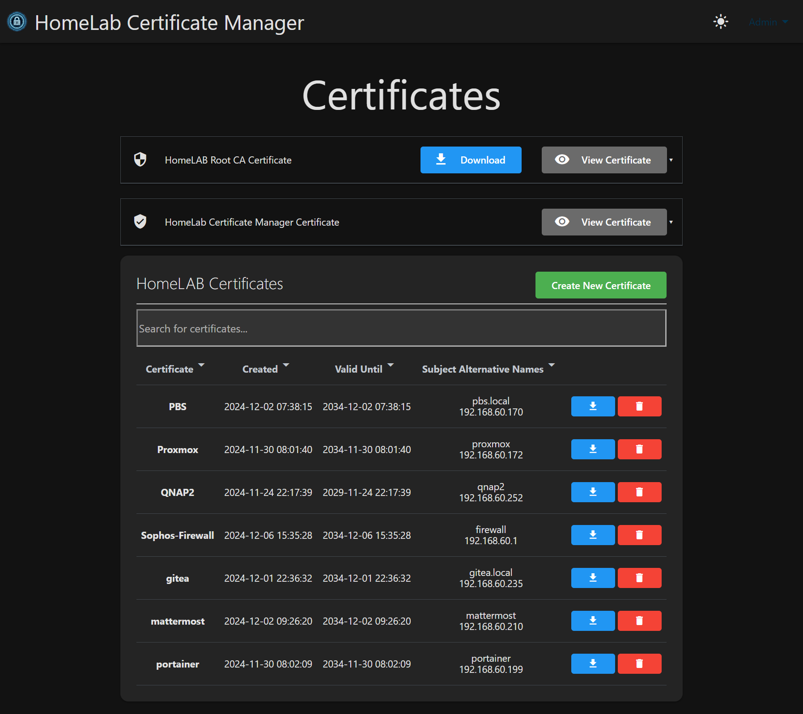

# Homelab Cert Manager

## Overview

Homelab Cert Manager is a Go project designed to manage SSL/TLS certificates for your homelab environment. 
This tool can generate a Homlab Root-Certificate and additional certificates for your homelab-services like docker-containers or devices.

All you need to do is import and trust the generated Root-Certificate once to your PC and generate a new certificate for each of your services.

This certificates can then be used, to configure SSL for or replace the selfsigned cert of your HomeLAB services.

Then your internal sites show secure connections in all modern browsers.

## Features

- **Internal Certificate Management:** Generate and manage internal SSL/TLS certificates.
- **Ease of Use:** Simple configuration and operation.
- **Dark/Light Mode:** Toggle between dark and light themes.
- **Search/Filter:** Easily search and filter certificates in the table.
- **Settings Page:** Configure certificate defaults and other settings.

## Screenshot

## Getting Started

To use Homelab Cert Manager, just download and install the Docker-Image from the github-repo (ghcr.io/cbrosius/homelab_cert_manager/homelab_cert_manager:latest)

As an alternative you can clone the repo and compile the project by yourself locally.
